# Visualizing bird tracking data with CartoDB

A workshop by [Peter Desmet](https://twitter.com/peterdesmet) at the [Animal Movement Analysis Summer Course](http://horizon.science.uva.nl/scge2015-wiki/doku.php) on July 10, 2015 at the University of Amsterdam.

## Introduction

[CartoDB](http://cartodb.com) is a tool to explore, analyze and visualize geospatial data online. In my opinion, it's like Gmail or GitHub: one of the best software tools ever. CartoDB is being used in a [wide area of domains](https://cartodb.com/gallery) (e.g. [education and research](https://cartodb.com/industries/education-and-research/)): in this workshop I'll give an introduction on how to use it for tracking data.

## Create account

**Go to <https://cartodb.com/signup> to create an account**. Free accounts allow you to upload 50MB as public tables.

## Login

1. On login, you see your private dashboard. This is where you can upload data, create maps and manage your account.
2. CartoDB will display contextual help messages to get you to know the tool. For an overview, see [the documentation on the CartoDB editor](http://docs.cartodb.com/).
3. You have a `dashboard/maps` overview and `dashboard/datasets` overview.
4. You also have a public profile (`https://user.cartodb.com/maps`). All datasets you upload and maps you create will be visible there.

## Upload data

1. Download [this tracking data file](http://horizon.science.uva.nl/public/AMA_2015/DAY5/CartoDB/scge_lbbg_migration.csv.zip)
2. **Go to your datasets overview.**
3. **Upload `scge_lbbg_migration.csv`** (or the zip, it doesn't matter) by dragging the file to your browser window. CartoDB recognizes [multiple files formats](http://docs.cartodb.com/cartodb-editor.html#supported-file-formats).

## Data view

1. CartoDB is powered by PostgreSQL and PostGIS.
2. CartoDB has created a table from your file and done some automatic interpretation of the data types. Some additional columns have been created as well, such as `cartodb_id`.
3. Geospatial data are interpreted automatically in `the_geom`. This interpretation assumes the geodetic datum to be `WGS84`. `the_geom` supports points, lines and polygons, but only one type per dataset.
4. Click the arrow next to field name to manipulate columns: e.g. delete, alter data type, etc.
5. Most of the functionality is in the toolbar on the right hand side: e.g. `Merge datasets`, `Add rows` and `Filters`.
6. Filters are great for exploring the data. **Try out the filter for altitude.**

    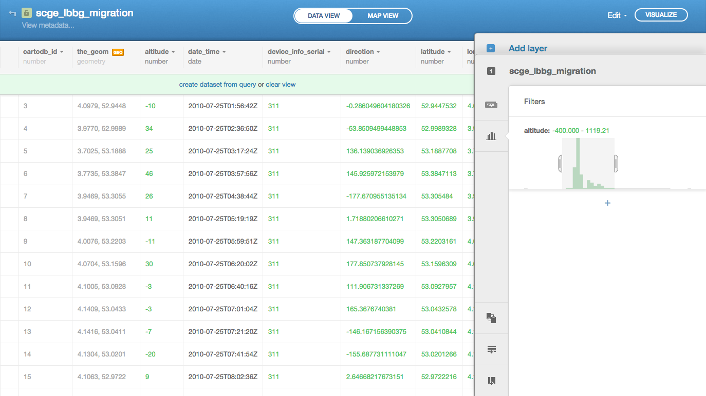

7. Filters are actually just SQL, a much more powerful language to select, aggregate or update your data. CartoDB supports all PostgreSQL and PostGIS SQL functions.
8. Click `SQL` in the toolbar and **try this SQL** to get some statistics about the scope of the dataset:

    ```SQL
    SELECT
        count(*) AS occurrences,
        min(date_time) AS min_date_time,
        max(date_time) AS max_date_time,
        count(distinct device_info_serial) AS individuals
    FROM scge_lbbg_migration
    ```

9. **Click** `Clear view` to remove any applied SQL.
 
## Create your first map

1. **Click** `Visualize` in the top right to create your first map and **name it** `My first map`.
2. **Click** `Map view`.
3. You can change the background map by clicking `Change basemap` in the bottom right. `Positron` is a good default basemap, but there are many more options available and even more via `Yours` (including maps from NASA).
4. Click `Options` in the bottom right to select the map interaction options you want to provide to visitors of your map, such as `Zoom controls` or a `Fullscreen` button.
5. Map view also provides a toolbar on the right: we already know `SQL` and `Filters` from the data view.
6. **Click** `Wizards` in the toolbar to see lots of visualization options. These are all explained in the [CartoDB documentation](http://docs.cartodb.com/cartodb-editor.html#map-wizards).
7. **Try** `Intensity` with the following options:

    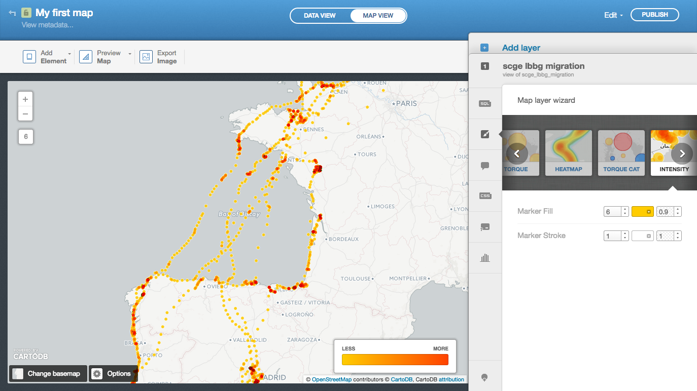

8. **Try** `Choropleth` with the following options (see the [documentation](http://docs.cartodb.com/cartodb-editor.html#choropleth) for different quantification methods):

    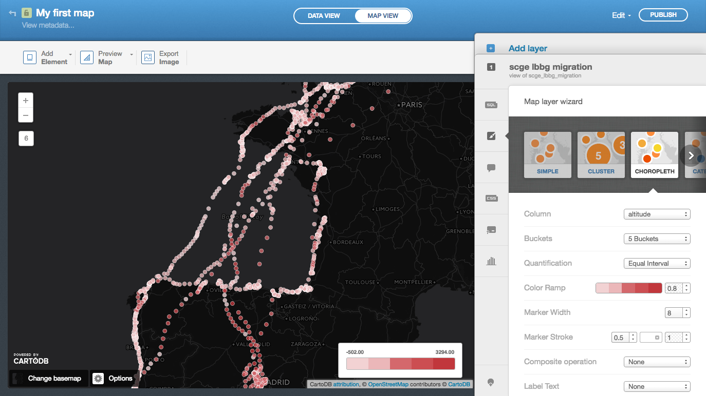

9. Just like the filters are powered by SQL, the wizards are powered by CartoCSS, which you can use to fine-tune your map. **Click** `CSS` in the toolbar to discover how the quantification buckets are defined:

    ```CSS
    /** choropleth visualization */

    #scge_lbbg_migration{
      marker-fill-opacity: 0.8;
      marker-line-color: #FFF;
      marker-line-width: 0.5;
      marker-line-opacity: 1;
      marker-width: 8;
      marker-fill: #F2D2D3;
      marker-allow-overlap: true;
    }
    #scge_lbbg_migration [ altitude <= 3294] {
       marker-fill: #C1373C;
    }
    #scge_lbbg_migration [ altitude <= 2345] {
       marker-fill: #CC4E52;
    }
    #scge_lbbg_migration [ altitude <= 1396] {
       marker-fill: #D4686C;
    }
    #scge_lbbg_migration [ altitude <= 447] {
       marker-fill: #EBB7B9;
    }
    #scge_lbbg_migration [ altitude <= -502] {
       marker-fill: #F2D2D3;
    }
    ```

## Create a map of migration speed

1. We want to save our previous work and create another map. **Click** `Edit > Duplicate map` and **name it** `Where does gull 311 rest?`.
2. **Add a `WHERE` clause to the SQL** to only select gull 311 between specific dates:

    ```SQL
    SELECT *
    FROM scge_lbbg_migration
    WHERE
        device_info_serial = 311
        AND date_time >= '2010-08-01'
        AND date_time <= '2011-03-30'
    ```

3. We want to visualize the travel speed of gull 311. The best way to start is to **create a `Choropleth` map**, with the following options:

    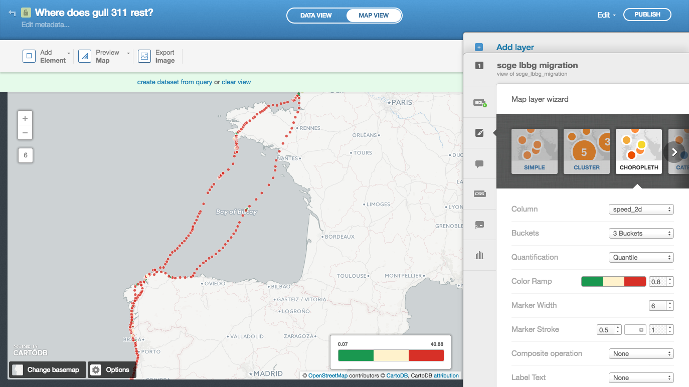

4. Most of the dots are red and the story does not come across yet. Let's dive into the CSS to **fine-tine the map**. We basically set all dots to green, except where the speed is below 2m/s, which we show larger and in red:

    ```CSS
    /** choropleth visualization */

    #scge_lbbg_migration{
      marker-fill-opacity: 0.8;
      marker-line-color: #FFF;
      marker-line-width: 0.5;
      marker-line-opacity: 1;
      marker-width: 6;
      marker-fill: #1a9850;
      marker-allow-overlap: true;
    }
    #scge_lbbg_migration [ speed_2d < 2] {
      marker-fill: #d73027;
      marker-width: 10;
      marker-line-width: 1;
    }
    ```

5. **Click** `Legends` in the toolbar to manually set what to be shown in the legend:

    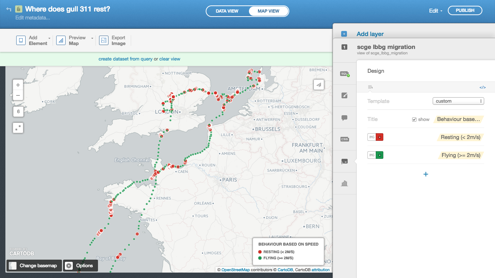

6. Click a point and chose `Select field` to **create an info window**.

    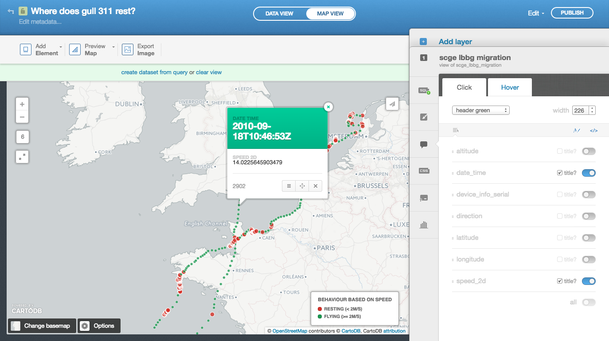

7. **Describe your map** by clicking `Edit metadata...` in the top left.
8. **Share your map** by clicking `Publish` in the top right. The sharing dialog box provides you with a link to the map or the code to embed it in a web page. The `CartoDB.js` is for advanced use in apps.
9. **Copy the link and paste it in a new browser tab** to verify the info windows and the bounding box (i.e. is the interesting part of the data visible?). Anything you update in your map (including zoom level and bounding box) will affect the public map (reload the page to see the changes).

[See the final map](https://inbo.cartodb.com/u/lifewatch/viz/7ad8e926-2644-11e5-9890-0e4fddd5de28/public_map)

## Create a map of tracks per month

1. **Duplicate** your map and **name it** `Tracks per month`.
2. This time we want to string the occurrences together as lines: one line per individual (sorted on date), per month. **This can be done in the SQL**. See the [PostgreSQL documentation](http://www.postgresql.org/docs/9.4/static/functions-datetime.html) for date functions. `the_geom_webmercator` is a geospatial field that is calculated by CartoDB in the background based on `the_geom` and is used for the actual display on the map. Since we're defining a new geospatial field (i.e. a line), we have to explicitely include it.

    ```SQL
    SELECT
        ST_MakeLine(the_geom_webmercator ORDER BY date_time ASC) AS the_geom_webmercator,
        extract(month from date_time) AS month,
        device_info_serial
    FROM scge_lbbg_migration
    WHERE
        date_time >= '2010-08-01'
        AND date_time <= '2010-12-31'
    GROUP BY
        device_info_serial,
        month
    ```

3. We want to display each month in a different colour, so **start with a `Choropleth` map**, with the following options:

    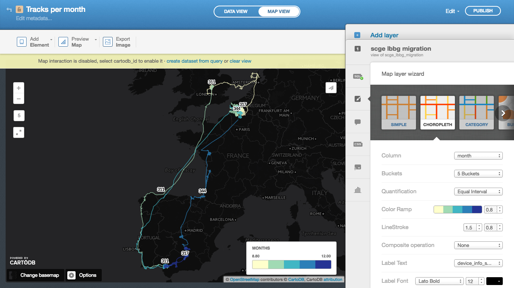

4. We will also include labels (start doing this in the `Choropleth` options), so you can still see which track belongs to which individual. **Fine-tune the map in the CSS**:

    ```CSS
    /** choropleth visualization */

    #scge_lbbg_migration{
      polygon-opacity: 0;
      line-color: #FFFFCC;
      line-width: 1.5;
      line-opacity: 0.8;
    }

    #scge_lbbg_migration::labels {
      text-name: [device_info_serial];
      text-face-name: 'Lato Bold';
      text-size: 12;
      text-label-position-tolerance: 10;
      text-fill: #000;
      text-halo-fill: #FFF;
      text-halo-radius: 2;
      text-dy: -10;
      text-allow-overlap: false;
      text-placement: interior;
      text-placement-type: simple;
    }

    #scge_lbbg_migration [ month <= 12] {
       line-color: #253494;
    }
    #scge_lbbg_migration [ month <= 11] {
       line-color: #2C7FB8;
    }
    #scge_lbbg_migration [ month <= 10] {
       line-color: #41B6C4;
    }
    #scge_lbbg_migration [ month <= 9] {
       line-color: #A1DAB4;
    }
    #scge_lbbg_migration [ month <= 8] {
       line-color: #FFFFCC;
    }
    ```

5. **Update the legend**:

    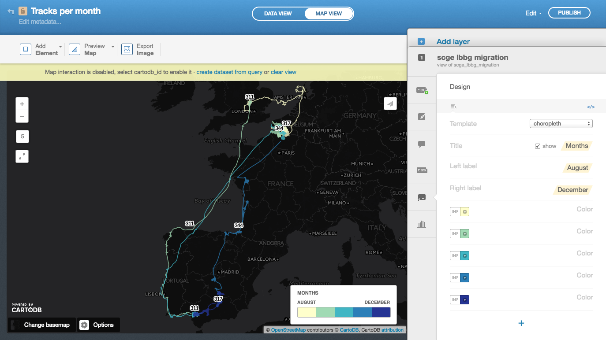

6. To provide some more context, let's annotate the map. In the top right, **click** `Add Element > Add annotation item` and **indicate summer and winter locations**:

    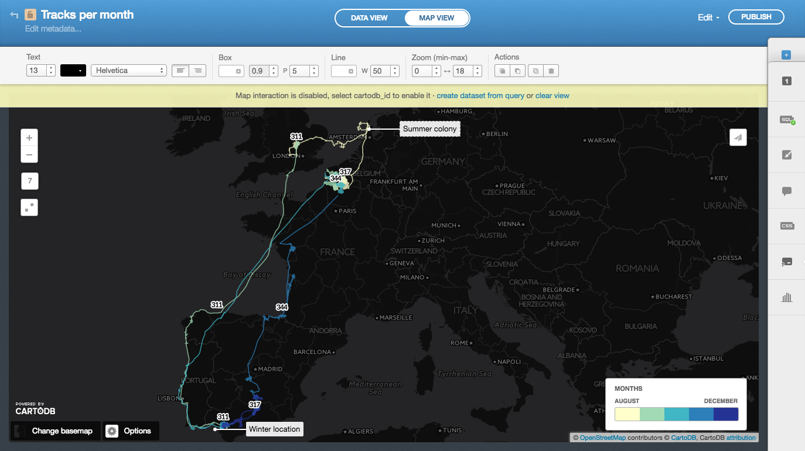

7. Finally, **update the description** in `Edit metadata...` and **publish your map**.

[See the final map](https://inbo.cartodb.com/u/lifewatch/viz/3f607d1c-264b-11e5-9d8b-0e018d66dc29/public_map)

## Create an animated map

1. **Duplicate** your map and **name it** `Migration in time`.
2. This time, we'll add a map on top of the previous one. **Click** `+` on the right hand side to add a new layer and **choose the same table** `scge_lbbg_migration`.

    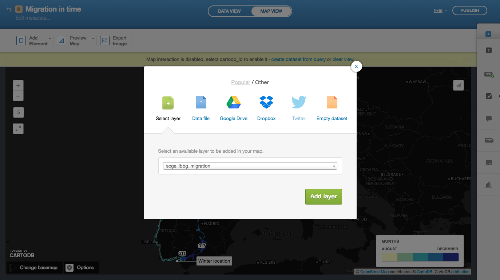

3. **Apply the same time contraints** in the SQL:

    ```SQL
    SELECT * 
    FROM scge_lbbg_migration
    WHERE
        date_time >= '2010-08-01'
        AND date_time <= '2010-12-31'
    ```

4. From the `Wizards`, **choose** `Torque cat`, with the following options. The `Time Column` should always be your date.

    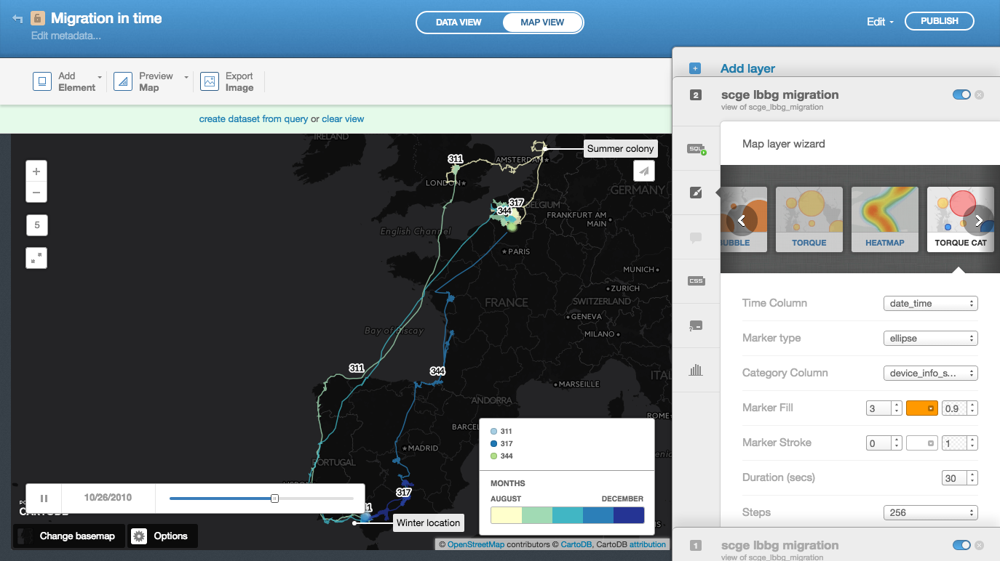

    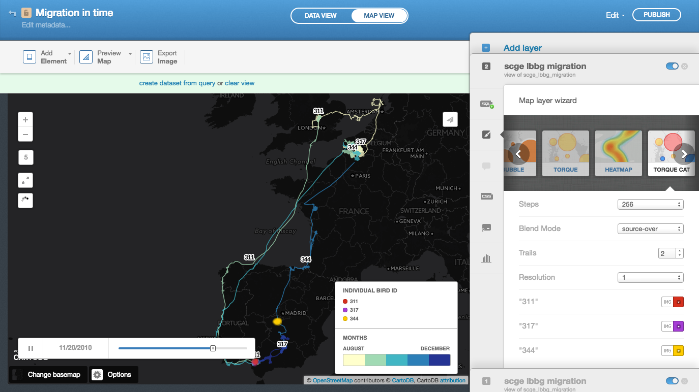

5. The final CSS looks like this:

    ```CSS
    /** torque_cat visualization */

    Map {
    -torque-frame-count:256;
    -torque-animation-duration:30;
    -torque-time-attribute:"date_time";
    -torque-aggregation-function:"CDB_Math_Mode(torque_category)";
    -torque-resolution:1;
    -torque-data-aggregation:linear;
    }

    #scge_lbbg_migration{
      comp-op: source-over;
      marker-fill-opacity: 0.9;
      marker-line-color: #FFF;
      marker-line-width: 0;
      marker-line-opacity: 1;
      marker-type: ellipse;
      marker-width: 3;
      marker-fill: #FF9900;
    }
    #scge_lbbg_migration[frame-offset=1] {
     marker-width:5;
     marker-fill-opacity:0.45; 
    }
    #scge_lbbg_migration[frame-offset=2] {
     marker-width:7;
     marker-fill-opacity:0.225; 
    }
    #scge_lbbg_migration[value=1] {
       marker-fill: #D6301D;
    }
    #scge_lbbg_migration[value=2] {
       marker-fill: #A53ED5;
    }
    #scge_lbbg_migration[value=3] {
       marker-fill: #FFCC00;
    }
    ```

6. **Update the legend**, **remove the `device_info_serial` labels** from the other layer (they are no longer required) and **publish your map**.

[See the final map](https://inbo.cartodb.com/u/lifewatch/viz/a36b9c78-2679-11e5-a586-0e853d047bba/public_map)

## Further reading

This is just the beginning: upload your own tracking data, play with the settings, and start creating beautiful maps. For inspiration and tutorials, see:

* [LifeWatch INBO maps](https://inbo.cartodb.com/u/lifewatch/maps): lots of tracking data maps
* [LifeWatch INBO blog posts on CartoDB](http://lifewatch.inbo.be/blog/tag/cartodb.html): tutorials and things we`ve build with CartoDB
* [CartoDB map gallery](https://cartodb.com/gallery/): the cream of the crop of CartoDB maps
* [CartoDB academy](http://academy.cartodb.com/): step by step tutorials on how to create maps in CartoDB
* [CartoDB documentation](http://docs.cartodb.com/): if you want to know more about all the features
